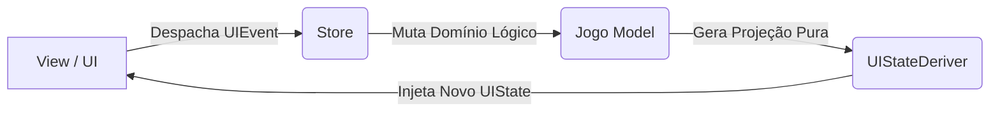

# 🏛️ Torre de Hanói Premium

Uma implementação ultra-madura e reativa da Torre de Hanói desenvolvida em **Java 21** e **JavaFX**. O projeto elimina os padrões frágeis tradicionais de desenvolvimento de interfaces desktop, adotando uma arquitetura unidirecional inspirada no ecossistema moderno da web (Flux/Redux) combinada com um escalonador concorrente de renderização baseado nos conceitos do React Fiber.

---

## 🛠️ Pilares Arquiteturais e Engenharia de Software

### 1. Fluxo de Dados Unidirecional (Flux/Redux Pattern)
Em vez de permitir que múltiplos controladores alterem o estado dos componentes visuais de forma desordenada, este sistema centraliza todo o comportamento na classe `Store`.
* **Single Source of Truth:** O estado lógico e posicional do jogo reside unicamente no `UIState`.
* **Event Dispatching:** A interface periférica não manipula o modelo diretamente. Cliques capturados disparam registros atômicos via `UIEvent` (uma *sealed interface* imutável).
* **Pure State Derivation:** O `UIStateDeriver` atua como um redutor puro. Ele recebe as coordenadas brutas do domínio lógico e as injeta na métrica matemática parametrizada de `LayoutConfig`, gerando uma nova projeção cartográfica imutável mapeada por `DiscoId`.



### 2. Scheduler Concorrente Controlado (React Fiber Design)
Para mitigar quebras de frames e colisões causadas por múltiplas transições assíncronas concorrentes na linha de execução de UI (`JavaFX Application Thread`), o sistema dispensa flags manuais (*locks booleanos*).
* **Render Task Queue:** A classe `RenderScheduler` delega as animações à uma fila thread-safe baseada em `ConcurrentLinkedQueue`.
* **Non-Blocking Interruptions:** As tarefas visuais em execução bloqueiam novas sobreposições destrutivas. Novas ações aguardam em fila através do interceptador nativo `setOnFinished`, simulando o comportamento de agendamento do React Fiber.

### 3. Identidades Fortes e Imutabilidade Total
* **Value Objects (DiscoId):** Substituímos o uso de strings arbitrárias ou inteiros sequenciais por um tipo composto imutável encapsulando um `UUID`. Isso blinda o *diff engine* do renderizador contra colisões de memória.
* **Imutabilidade Estrutural:** As classes `Disco`, `UIState` e `LayoutConfig` utilizam Java Records nativos, enquanto a classe `Torre` expõe apenas invólucros de leitura via `Collections.unmodifiableList`.

---

## 🎨 Especificação Visual (Catppuccin Macchiato)

O sistema adota estritamente a paleta cromática pastel do tema **Catppuccin Macchiato** injetada dinamicamente via `Tema.java`:
* 🧱 **Fundo Geral:** `#24273a` (Base)
* 🏷️ **Tipografia Dinâmica:** `#cad3f5` (Text)
* ⚡ **Indicador de Seleção:** `#eed49f` (Yellow)
* 🗼 **Estações de Pinos:** `#8bd5ca` (Teal), `#91d7e3` (Sky), `#7dc4e4` (Sapphire)

---

## 🗂️ Estrutura de Pastas e Separação de Conceitos

```text
src/main/java/com/hanoi/
├── Main.java               # Bootstrapper e orquestrador de injeção de dependências
├── config/
│   ├── LayoutConfig.java   # Configurações e métricas geométricas injetáveis
│   └── Tema.java           # Enums cromáticos imutáveis da especificação de design
├── model/
│   ├── Disco.java          # Entidade record do disco utilizando identidade forte
│   ├── DiscoId.java        # Value Object tipado base para o motor de diferenciação
│   ├── Jogo.java           # Motor puramente lógico e validador matemático das torres
│   └── Torre.java          # Estrutura lógica encapsulada baseada em Stack
├── state/
│   ├── Store.java          # Única fonte de verdade e gerenciador reativo de estado
│   ├── UIEvent.java        # Sealed interface definindo eventos atômicos capturáveis
│   ├── UIState.java        # Snapshot posicional e estrutural imutável do sistema
│   └── UIStateDeriver.java # Projetor posicional livre de acúmulo de responsabilidade
└── view/
    ├── Renderer.java       # Sincronizador reativo da árvore de nós do JavaFX
    └── RenderScheduler.java# Escalonador controlado e assíncrono de animações
```

---

## 🚀 Como Executar o Projeto

O projeto utiliza o **Gradle** como automação de compilação. Certifique-se de possuir o Java 21 ou superior instalado na máquina.

```bash
# Clone o repositório
git clone https://github.com

# Acesse a pasta raiz
cd torre-hanoi

# Execute a aplicação através do Gradle Wrapper
./gradlew run
```
